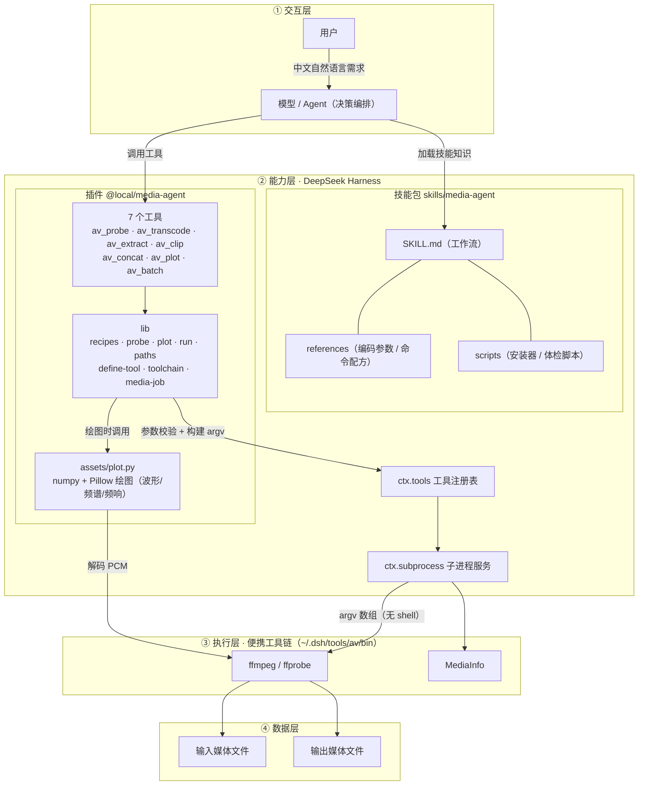
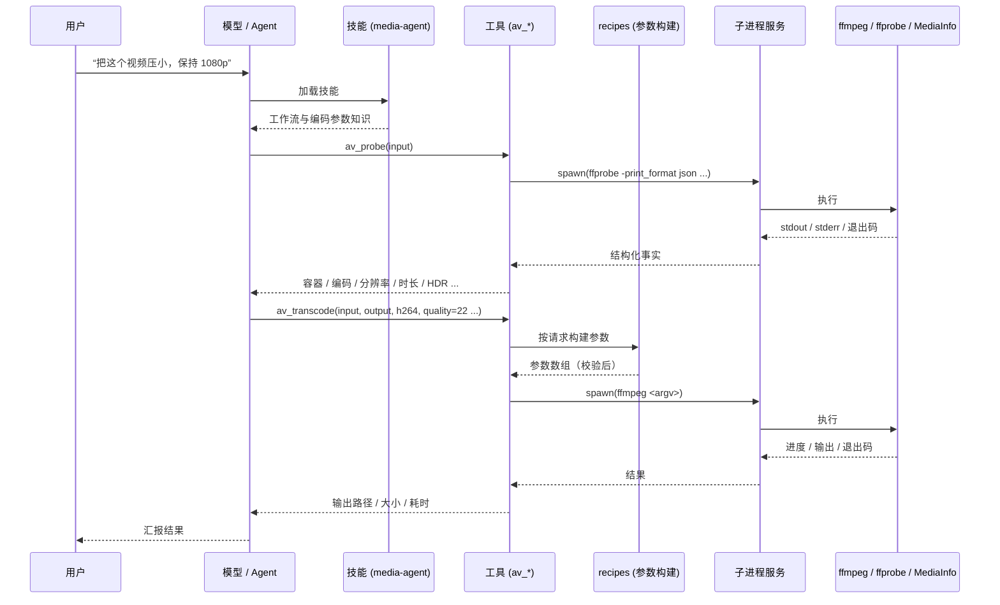

# Media Agent 架构图

> 在 GitHub 上打开本文件时，下面的 Mermaid 图会自动渲染。

## 一、分层架构

## 二、一次请求的调用流程

## 三、关键设计要点

| 层 | 要点 |
|---|---|
| 交互层 | 用户只讲自然语言，模型负责选工具、定参数、校验结果 |
| 能力层 | 技能负责"知道怎么做"，插件负责"安全地做"；两者解耦，可独立更新 |
| 执行层 | 工具链是便携二进制，装用户目录，不污染系统 PATH，跨 Windows / macOS |
| 数据层 | 输入/输出都是工作区里的普通文件，不覆盖源文件 |

**数据流核心**：模型决定 → 工具校验参数 → `recipes` 把请求变成 ffmpeg 参数数组 → `ctx.subprocess`
按 argv 数组执行（无 shell，杜绝注入）→ 采集输出/退出码 → 结构化回传 → 模型汇报。
